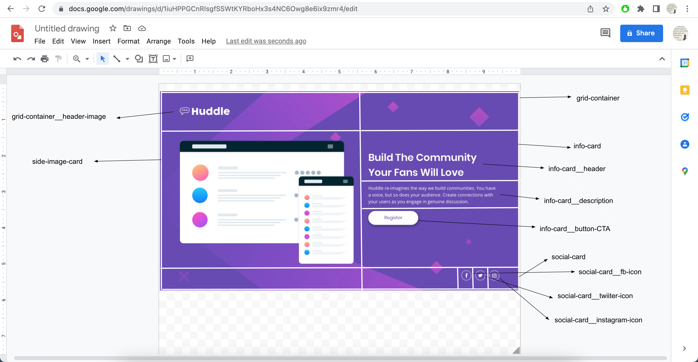
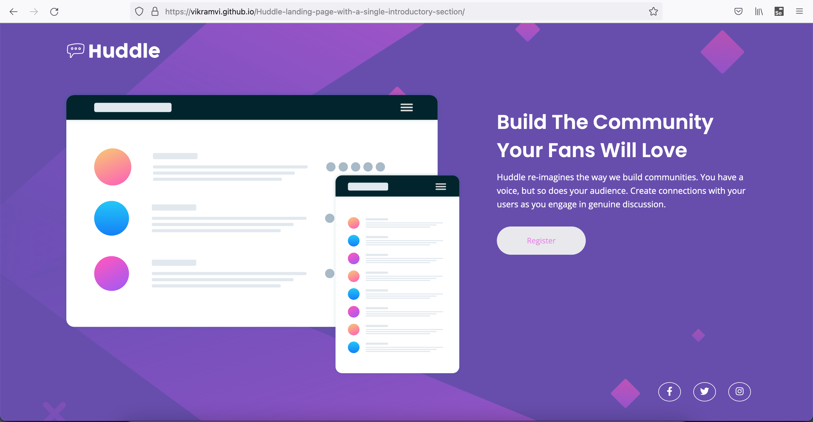
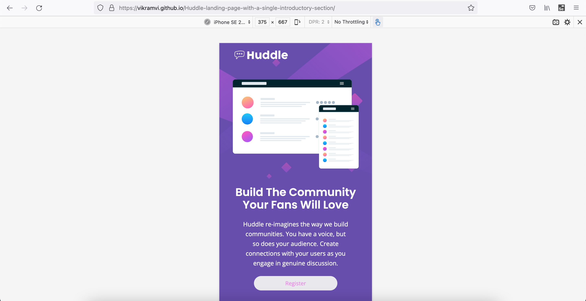

This is a solution to the [Huddle landing page with single introductory section challenge on Frontend Mentor](https://www.frontendmentor.io/challenges/huddle-landing-page-with-a-single-introductory-section-B_2Wvxgi0). Frontend Mentor challenges help you improve your coding skills by building realistic projects.

## Table of contents

- [Overview](#overview)
  - [The challenge](#the-challenge)
  - [Screenshot](#screenshot)
  - [Links](#links)
- [My process](#my-process)
  - [Built with](#built-with)
  - [What I learned](#what-i-learned)
  - [Continued development](#continued-development)
  - [Useful resources](#useful-resources)
- [Author](#author)
- [Acknowledgments](#acknowledgments)

## Overview

This is 8th project from "Frontend Mentor" to sharpen HTML & CSS skills along with responsive web design and it's build with "BEM" and "Grid layout".

### The challenge

Users should be able to:

- View the optimal layout for the page depending on their device's screen size
- See hover states for all interactive elements on the page

### Screenshot

### Links

- [Live Site URL](https://vikramvi.github.io/Huddle-landing-page-with-a-single-introductory-section/)

## My process

### Built with

- Semantic HTML5 markup
- CSS BEM
- CSS Grid
- Mobile-first workflow

### What I learned

- "width, "max-width" usage wrt CSS Grid
- Trial error from FF dev tool before doing actual code change
- fontawesome icon usage and related properties
- Grid item horizontal, vertical placing

### Continued development

- More practice, reading, study is needed wrt BEM, SEO, Accessibility, CSS, HTML

### Useful resources

- Frontend Mentor slack community + website
- YT videos
- Google ofcourse
- Stackoverflow

## Author

- Frontend Mentor - [@vikramvi](https://www.frontendmentor.io/profile/vikramvi)

## Acknowledgments

- FM community
- YT content creators
- Google + SO community
